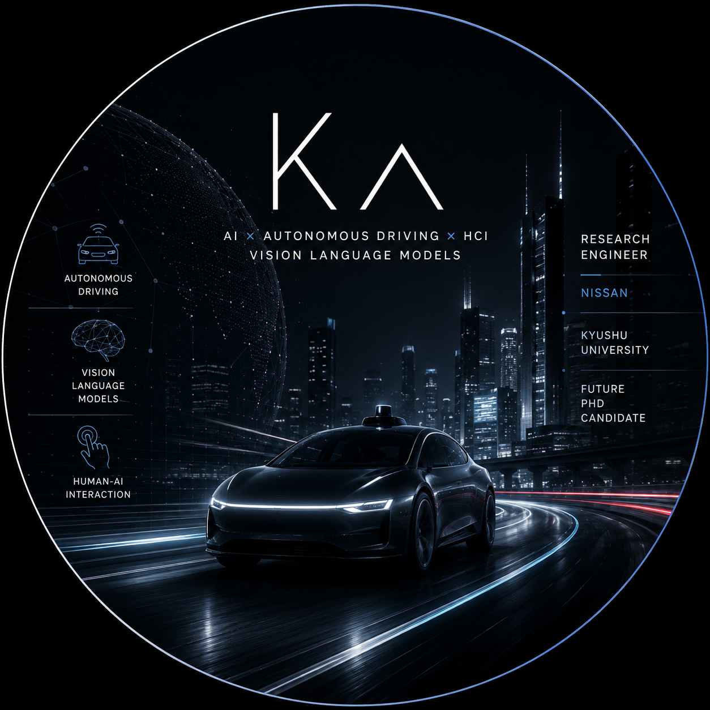

<!--
  github.com/s1280061/s1280061  —  Profile README
  Transparent-background widgets keep both light & dark mode clean.
-->

# Kaito Asai

### AI Research Engineer · Autonomous Driving × Human-AI Interaction × Vision-Language Models

Building the future of autonomous driving with AI, cooperative perception, and human-centered design.

 

 

## About

- 🎓 &nbsp;**M.S. in Automotive Science**, Kyushu University
- 🚗 &nbsp;**AD / ADAS Research Engineer** — perception & prediction for advanced driver assistance
- 📄 &nbsp;**2 publications** in autonomous-driving venues — IEEE BigData 2025, IEICE ITS 2026
- 🧠 &nbsp;Researching **risk-aware perception, cooperative perception (V2X), and Vision-Language Models** for driving safety
- 🤝 &nbsp;Designing **interpretable, human-centered** assistance — from risk forecasting to actionable driver advice

 

## Research Areas

 

## Featured Projects

#### 🚗 [RiSA — Risk-aware Situational Assistant](https://github.com/s1280061/RiSA-clean)
Risk forecasting to actionable driver advice. &nbsp;`IEEE BigData 2025`

#### 🛰️ [V2X Cooperative Perception](https://github.com/s1280061/v2x-lang-risa)
Infrastructure–ego sensor fusion for robust, occlusion-resilient perception.

#### 📑 [Patent Agent](https://github.com/s1280061/patents_dev)
Prior-art search and patent analysis for autonomous-driving R&D.

#### 🧭 [Morning Research OS](https://github.com/s1280061/morning-research-os)
AI-powered workspace that streamlines a researcher's daily workflow.

 

## Tech

<!-- AI x Autonomous Driving x HCI -->

<!-- research engineer profile -->

<!-- ad x ai x hci -->
